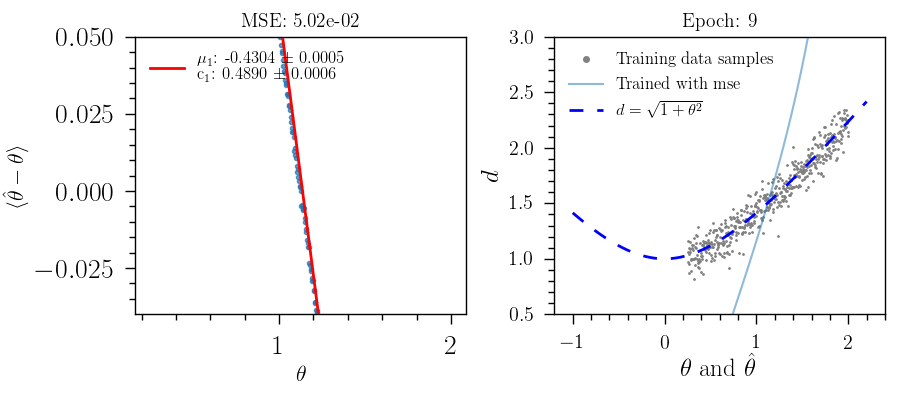
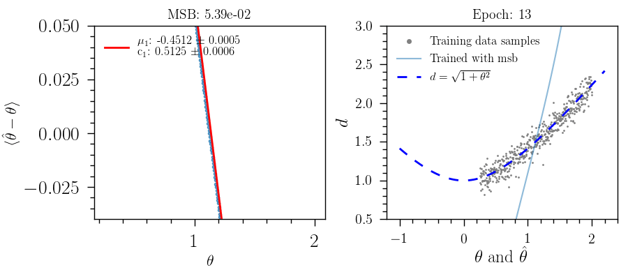

Regressions
###########
In this example, a simple network is created to inverse regress the function :math:`f(\theta)=\sqrt{1.0+\theta^{2}}`, this means we want to predict :math:`\hat{\theta}`, given a set of noisy measurements of :math:`f(\theta)`.

We created 3D mock data with the structure (ncases, nreas, nfeats). Where ncases is the number of targets values, nreas is the number of realizations associated to different draws of the noise, and nfeats is the number of features. In these examples two options can be tested, using as training features the sets: :math:`\left(f(x)+n\right)`, or :math:`\left(f(x)+n, n\right)`.

Point estimate inverse regression
#################################

Training of NN with one layer of five neurons and one output node using MSE and MSB, and the two features mentioned before.

Point estimate inverse regression with Dropout
##############################################

Training of NN with one layer of five neurons, one output node, and a dropout probability of 0.4. Below the comparison using MSE and MSB, and the two features mentioned before.

.. image:: ../examples/regression/inverse/animations/out/point_noise_regression_dropout_animation_2feats_msb/validation/inverse_regression.gif
  :width: 600
  :alt: Using MSB
